# 06 — System Diagrams

The whole system in pictures. Every diagram is Mermaid, so it renders in GitHub,
VS Code and most markdown viewers without any tooling.

Scope note: diagrams marked **V1** show only what `05-scope-and-v1.md` puts in
the first release. Where a V2 element appears for context it is drawn dashed or
labelled.

**Index**

| # | Diagram | Answers |
|---|---------|---------|
| 1 | [System landscape](#1-system-landscape) | What runs, and what talks to what |
| 2 | [Module dependencies](#2-module-dependencies) | Which app may import which |
| 3 | [The yearly loop](#3-the-yearly-loop) | What the institution actually does |
| 4 | [Request lifecycle](#4-request-lifecycle--the-four-gates) | How one API call is authorised |
| 5 | [Branch scope resolution](#5-branch-scope-resolution) | Whose data does this request see |
| 6 | [Permission resolution](#6-permission-resolution) | Can this user do this verb |
| 7 | [Admission to enrolment](#7-admission--enrolment) | How a person becomes a student |
| 8 | [Fee lifecycle](#8-fee-lifecycle-state-machine) | The states an invoice moves through |
| 9 | [Monthly fee generation](#9-monthly-fee-generation-celery) | How fees raise themselves |
| 10 | [Fee collection at the counter](#10-fee-collection-at-the-counter) | The money path, and the auto-posted income |
| 11 | [Attendance month grid](#11-attendance-month-grid) | The teacher's daily screen |
| 12 | [Examination to result](#12-examination--result) | Marks in, marksheet out |
| 13 | [Entity relationships](#13-entity-relationships-v1) | The V1 data model |
| 14 | [Scheduled jobs](#14-scheduled-background-jobs) | What happens without anyone clicking |
| 15 | [UI navigation map](#15-ui-navigation-map) | Every screen, and who sees it |

---

## 1. System landscape

Seven containers. Only Traefik binds a host port — that is the security
boundary (`01` §2).

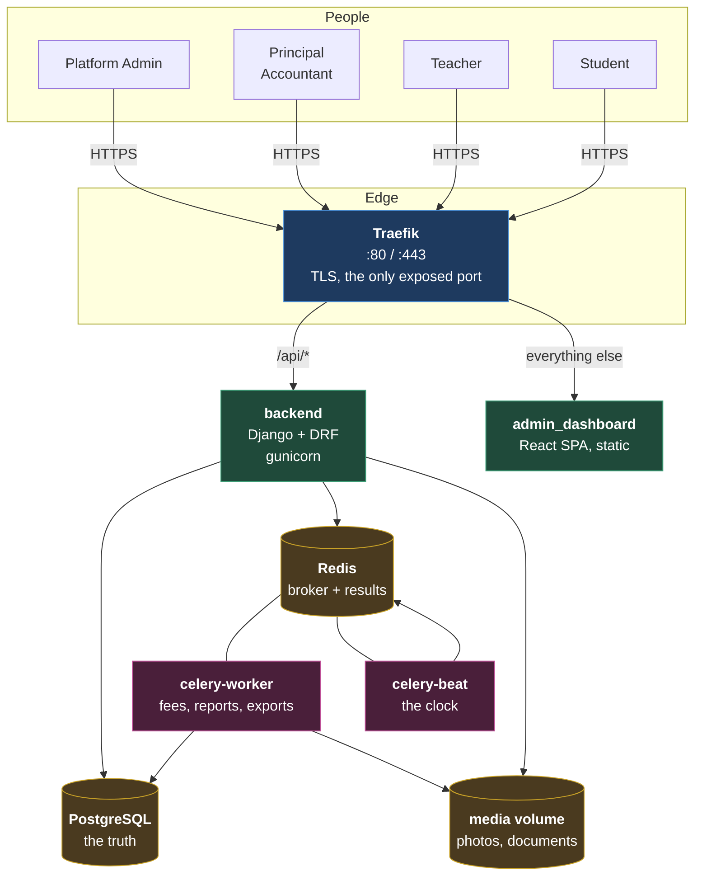

## 2. Module dependencies

One-way only. A cycle here is what turns a Django project into a ball of mud, so
this ordering is a rule, not an observation (`01` §6).

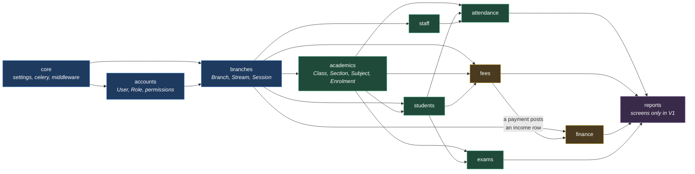

`reports` reads from everything and is read by nothing. `fees → finance` is the
only cross-module write, and it never goes the other way.

## 3. The yearly loop

This is the software. Every screen sits on top of this loop, and it is the test
for whether a feature belongs in V1: *does the loop complete without it?*
(`05` §2)

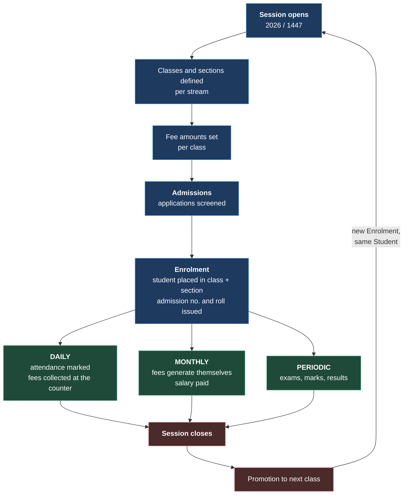

Note the return edge: promotion creates a **new Enrolment for the same Student**.
That is the entire reason `Enrolment` exists as a table (`05` §3.2).

## 4. Request lifecycle — the four gates

Order matters. Authentication says *who*; branch scoping says *which branch's
data exists at all*; the permission class says *what verb*; the queryset filter
is the belt-and-braces that turns a forgotten check into a 404 rather than a leak.

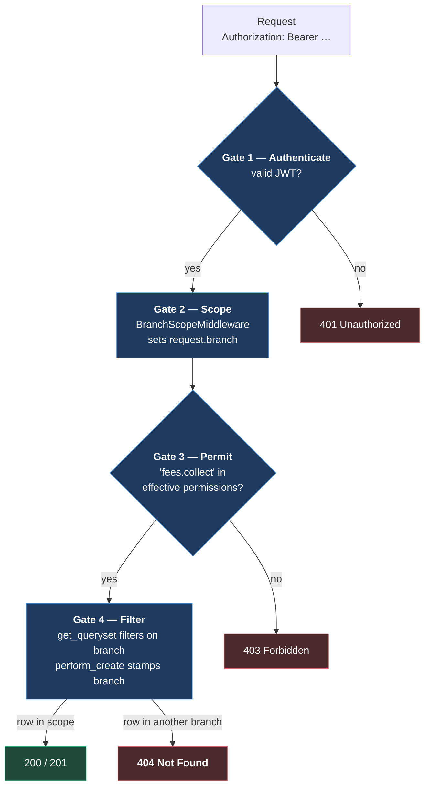

**404, not 403, for a wrong-branch row** — a 403 confirms the object exists.
This is asserted by a test in every module (`04` §2).

## 5. Branch scope resolution

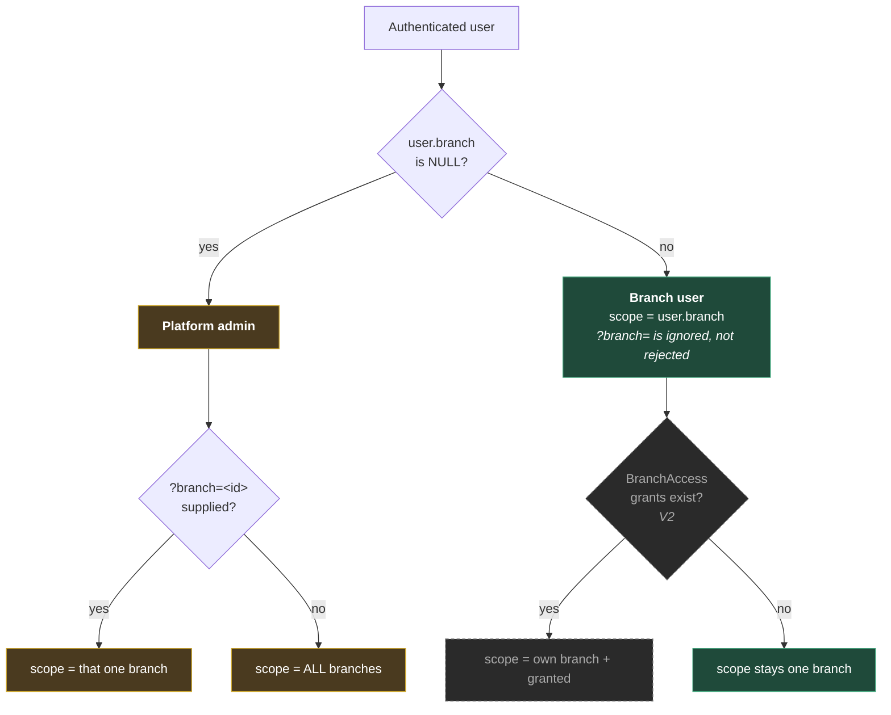

A copied platform-admin URL carrying `?branch=` therefore degrades safely in a
branch user's hands rather than erroring.

## 6. Permission resolution

Roles are **presets that tick boxes; the boxes are what is enforced.** An empty
list falls back to the preset, so accounts created before anyone customised
anything keep working (`02` §2).

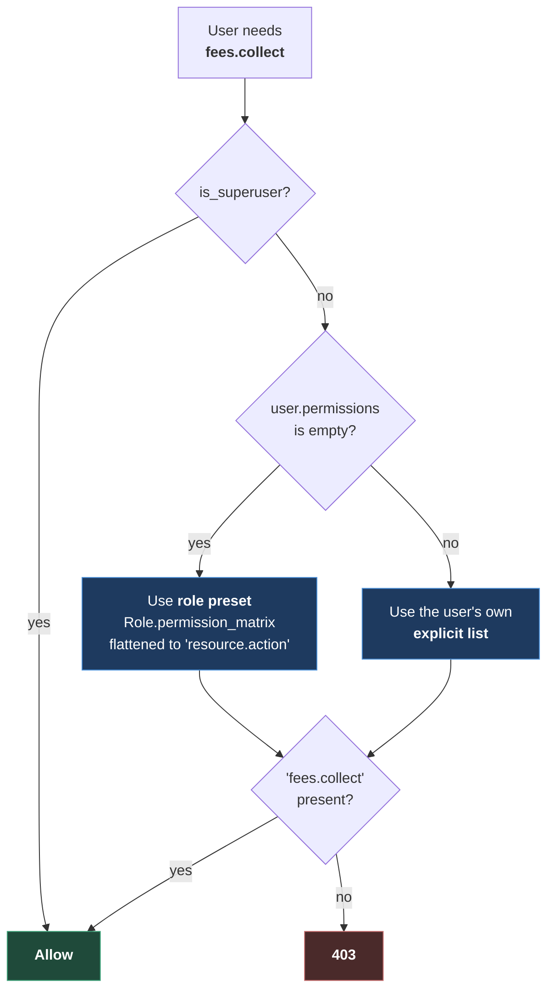

The catalogue of valid `resource.action` strings is served to the SPA from
`GET /api/accounts/permission-catalog/`, so the checkbox screen cannot drift
from what the backend enforces. One source of truth, not two copies.

## 7. Admission → enrolment

The conversion is **one transaction with three consequences**. All of it happens,
or none of it does.

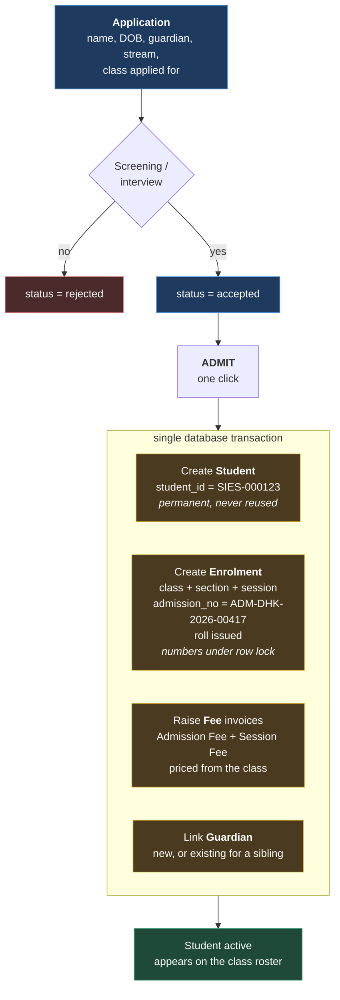

Re-admission next session creates **a new Enrolment, never a new Student**. The
"admission history" the brief asks for is `student.enrolments.all()` — a query,
not a stored copy that drifts.

## 8. Fee lifecycle state machine

Status is **derived, never hand-set**. A field a human can set to "paid" without
money arriving is an invitation.

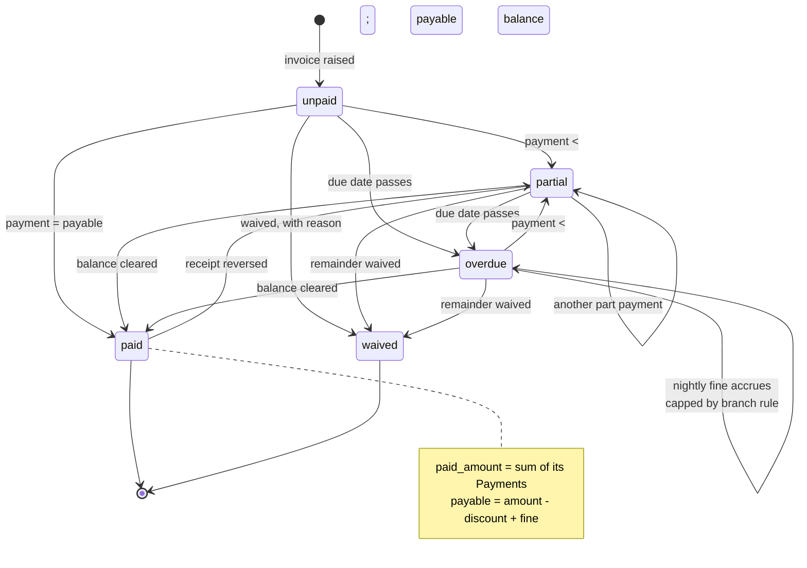

A wrong receipt is **reversed**, never deleted — deleting a paid invoice destroys
an accounting record (`01` §9).

## 9. Monthly fee generation (Celery)

Decision 2 of the "smart" list. Nobody clicks "raise this month's fees".

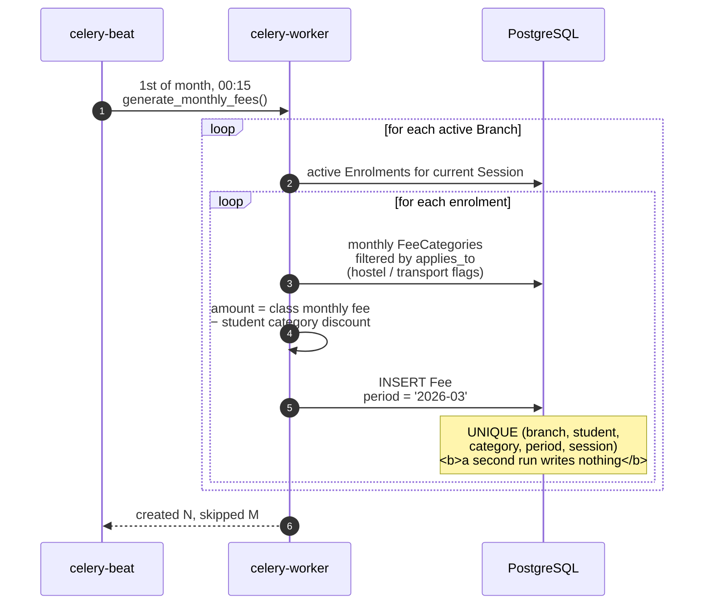

**Idempotency is enforced by the database, not by application code.** That
unique constraint is the single line standing between a retried job and a
double-charged guardian.

## 10. Fee collection at the counter

The most-used screen in the system, and the one cross-module write.

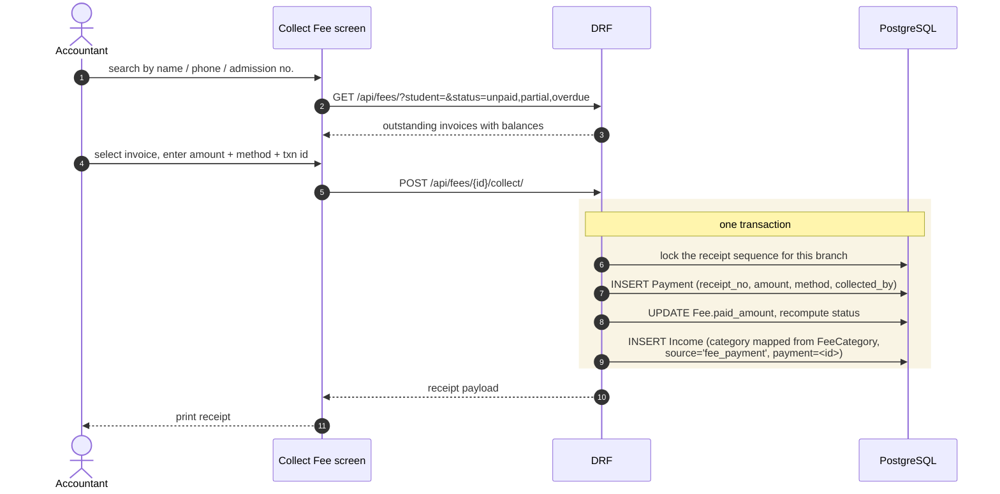

The **Income row is written by the system, not typed by a person.** That is why
the fee ledger and the accounts can never disagree — there is only one entry
(`05` §4.1).

## 11. Attendance month grid

Students down the side, thirty days across, marked cell by cell (`02` §4.4).

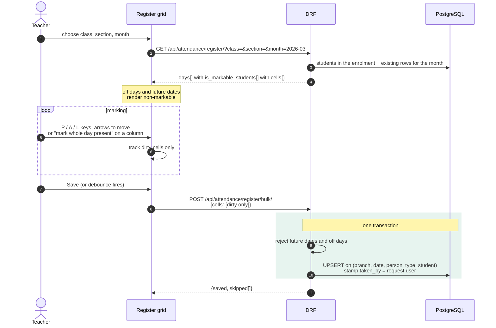

1,800 cells cannot be 1,800 requests — hence the batch endpoint. The upsert key
is the table's existing unique constraint, so saving twice writes the same rows.

## 12. Examination → result

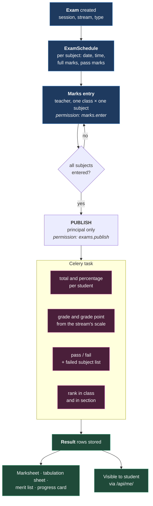

Results are **stored, not computed on read**: a marksheet reprinted in three
years must show the same numbers even if the grade scale has since been edited.
*(In V1 the grade scale is simplified — see `05` §5.4.)*

## 13. Entity relationships (V1)

The twenty-nine-table cut line. `Enrolment` in the centre is the join that makes
history correct.

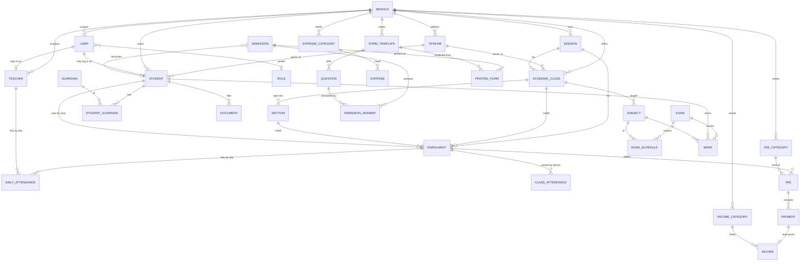

The three relationships that carry the design:

- `STUDENT ||--o{ ENROLMENT` — one person, many years.
- `FEE ||--o{ PAYMENT` — one invoice, many part payments.
- `PAYMENT ||--o| INCOME` — the money enters the accounts once, automatically.

## 14. Scheduled background jobs

Everything that happens without anyone clicking (`01` §4).

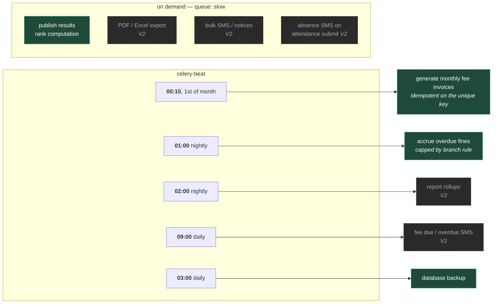

Two queues — `default` and `slow` — so one long export cannot starve fee
generation.

## 15. UI navigation map

Every sidebar entry is hidden unless `canView(resource)` passes, using the same
gate Awliaa's `DashboardLayout` already applies.

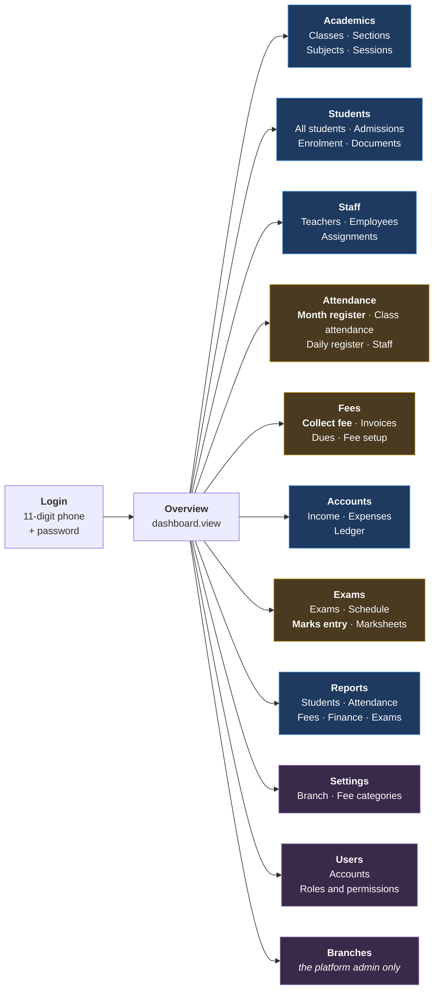

Highlighted are the three screens where the institution's hours are actually
spent: **the attendance month register**, **collect fee**, and **marks entry**.
They share one interaction model — a keyboard-driven grid with batch save — so a
teacher who learns one knows all three.

---

## 16. The system in one sentence

> A branch-partitioned ledger of **people**, **time** and **money**, wrapped
> around one yearly loop, in which the recurring clerical work — raising fees,
> accruing fines, posting income — happens by itself.
